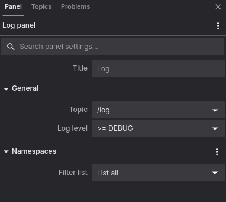

## Setup Our Tutorial Project

!!! note ""

    In this tutorial we will use `uv`.

Let's [create a new uv project](https://docs.astral.sh/uv/guides/projects/) and
[add the MCAP Logger](installation.md) package as dependency.

```shell
uv init mcap_logger_tutorial
cd mcap_logger_tutorial
uv add mcap-logger
```

After this we should have the following elements in the project's folder:

```
.
├── .python-version
├── README.md
├── hello.py
└── pyproject.toml
```

We can run our "Hello World" program with the following command:

```shell
uv run hello.py
```

This should produce the following output on your console:

```
Hello from mcap-logger-tutorial!
```

We will use this "Hello World" program as a base for our tutorial.

## Create Our First Log

First, let's import the `logging` package of Python and the `McapHandler` class into the `hello.py` script.
After we did the import, we will create our `Logger` entity with the `getLogger` function. We will call the logger
`mcap_logger`.

```python title="hello.py" linenums="1"
import logging
from mcap_logger.mcap_handler import McapHandler


def main():
    logger = logging.getLogger("mcap_logger")
    print("Hello from mcap-logger-tutorial!")

```

Then we will define the log file we want to create. To do that, we need to import `Path` and
specify the log file's name and path. In this case the log file will be called `hello.mcap` and we will place it
in the project's directory.

After this, we can create our mcap log handler by initializing it with the path of the log file.

!!! info

    If the parent directory of the defined log doesn't exist, the it will be created.

```python title="hello.py" linenums="1"
import logging
from pathlib import Path

from mcap_logger.mcap_handler import McapHandler


def main():
    logger = logging.getLogger("mcap_logger")
    log_file = Path("mcap_log.mcap")
    mcap_handler = McapHandler(log_file)
    print("Hello from mcap-logger-tutorial!")

```

When we created our handler then we have to add it to the logger. This means that when the logger logs a message then it
will hand it to our MCAP handler, which will put this into our log file.

We will set the level of logging to be `DEBUG` level both for the logger and for the handler. This basically means
that all log messages will be logged.

We will remove the original `print` statement and replace it with an info level log call.

```python title="hello.py" linenums="1"
import logging
from pathlib import Path

from mcap_logger.mcap_handler import McapHandler


def main():
    logger = logging.getLogger("mcap_logger")
    log_file = Path("mcap_log.mcap")
    mcap_handler = McapHandler(log_file)
    mcap_handler.setLevel("DEBUG")

    logger.addHandler(mcap_handler)
    logger.setLevel("DEBUG")

    logger.info("Hello from mcap-logger-tutorial!")


if __name__ == "__main__":
    main()

```

## Create The Log File

Now that we made modification to the `hello.py`, we can run our example again and see the
result.

```shell
uv run hello.py
```

!!! note

    There will be no console logs, because we only added and `McapHandler` to the logger.

Notice that we have a new file in our project directory called `hello.mcap`. This file is serialized with
[Protobuf](https://protobuf.dev/), so we can not open it with a text editor and look at the content of it.
To do that we will use [Foxglove Studio](https://foxglove.dev/download).

## Open Our Log File

Open Foxglove Studio and use the `Open local file...` command to open our `hello.mcap` log file. Our log messages is
using Foxglove's [Log schema](https://docs.foxglove.dev/docs/visualization/message-schemas/log), and we can visualise it
with a [Log panel](https://docs.foxglove.dev/docs/visualization/panels/log).

We can add a panel following [this guide](https://docs.foxglove.dev/docs/visualization/panels/introduction), and after
that we need to configure it to use the `/log` topic.

{ width="300" }
/// caption
log panel settings
///

After this we should see our info message on the log panel.

{ width="300" }
/// caption
log panel output
///

And Voilà! We made our first log with `mcap-logger`. :wink:

!!! tip "Filtering logs"

    Notice that in Foxglove Studio, you can filter the logs by their level in the log panel.
